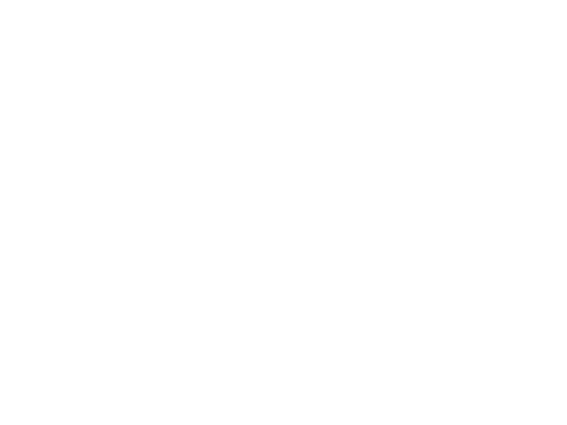

# Financial Topic Modeling for IPO Filings

Robust cross-validated Latent Dirichlet Allocation (LDA) analysis of IPO S-1 filings and analyst reports, built to surface investment-relevant themes with auditable metrics.

## Project Goal
- Pair SEC S-1 filings with downstream analyst commentary and learn dominant financial themes.
- Quantify topic stability via cross-validated perplexity and seed sweeps.
- Deliver reproducible artefacts (models, metrics, exports) for further equity research and NLP experimentation.

## Analysis Coverage
- `main.py` orchestrates 5-fold cross-validation, optional n-gram modeling, and best-topic selection.
- `run_cv_with_without_ngrams.sh` benchmarks both unigram and n-gram pipelines end-to-end.
- `lda_model_gensim.py` tunes multiple random seeds per fold and retains the lowest perplexity model.
- `test_lda_preprocessing.py` stress-tests tokenization, stopword loading, lemmatization, and TF-IDF filtering.
- `utils.py` aggregates fold-level metrics, exports dominant topic-term distributions, and captures reproducibility metadata.

## Setup with uv
1. Install uv once (if needed):
   ```bash
   curl -LsSf https://astral.sh/uv/install.sh | sh
   ```
2. Sync the project (creates `.venv` and installs pinned deps):
   ```bash
   uv sync
   ```
3. Pull auxiliary NLP assets:
   ```bash
   uv run python -c "import nltk; nltk.download('stopwords')"
   uv run python -m spacy download en_core_web_sm
   uv run python -m spacy download en_core_web_md
   ```

## Run the Pipeline
- Launch cross-validated modeling (default 5 folds, config-driven topic grid):
  ```bash
  uv run main.py --config config.yaml --output_subdir comparison/with_ngrams
  ```
- Force a specific topic count (skips grid search):
  ```bash
  uv run main.py --config config.yaml --num_topics 9 --output_subdir experiments/focused_9_topics
  ```
- Compare unigram vs n-gram pipelines in one shot:
  ```bash
  uv run bash run_cv_with_without_ngrams.sh
  ```
- Optional quick validation of preprocessing steps:
  ```bash
  uv run pytest test_lda_preprocessing.py
  ```

Key runtime flags:
- `--folds`: K-fold count for cross-validation (default 5).
- `--no_ngrams`: Disable bigram/trigram expansion.
- `--output_subdir`: Namespaced folder under `outputs/` for all artefacts.
- `--cv_random_state`: Controls fold shuffling reproducibility.

## Repository Layout
```
main.py                             # CV driver and full-model export
config.yaml                         # Preprocessing + LDA hyperparameters
run_cv_with_without_ngrams.sh       # Automated unigram vs n-gram benchmark
lda_model_gensim.py                 # Gensim training utilities + seed sweep logic
test_lda_preprocessing.py           # Integration-style preprocessing checks
utils.py                            # Metric aggregation, serialization, plotting
data_preprocessing/
├── enhanced_ipo_parser.py          # SEC filing parser with entity-aware cleanup
├── batch_ipo_processor.py          # Parallel ingestion of raw filings
└── ...                             # Tokenization + TF-IDF utilities
outputs/                            # Timestamped CV runs and model exports
stopwords/                          # Financial-domain stopword extensions
```

## Tech Stack
- Python 3.11 managed by `uv` for deterministic environments.
- Gensim for LDA modeling and perplexity scoring.
- spaCy (lemmatization / POS tagging) and NLTK (baselines + stopwords).
- pandas, NumPy, tqdm for data orchestration and progress tracking.
- Matplotlib (via `utils.py`) for metric visualizations.

## Preprocessing Pipeline Highlights
- SEC-specific cleaning to strip headers, HTML artefacts, and boilerplate (`test_lda_preprocessing.py:basic_preprocessing`).
- Configurable stopword layering: NLTK base + domain lists in `stopwords/`.
- Lemmatization gated by allowed POS tags and spaCy components defined in `config.yaml`.
- Optional bigram/trigram modeling with corpus-driven thresholds.
- TF-IDF based extreme-term filtering to stabilize LDA vocabulary.

## Outputs
- `outputs/<subdir>/cross_validation_metrics.(json|csv)` — fold-by-fold and aggregate perplexity, seed, and vocabulary diagnostics.
- `outputs/<subdir>/models_cv/` — per-fold, per-topic Gensim models for audit and reuse.
- `outputs/<subdir>/preprocessed/` — bag-of-words corpora, dictionaries, and zero-token reports to trace data hygiene.
- `outputs/<subdir>/full_model_export/` — dominant topic word probabilities and label-aligned token exports for the best topic count.
- `outputs/<subdir>/cv_perplexity_plot_<mode>.png` — topic count selection visualizations (see below).

## Perplexity vs Topics


- Steep perplexity drop from 1 to 9 topics; marginal gains beyond 11.
- Nine-topic configuration delivers the lowest held-out perplexity on the illustrated run.

## Configurability Notes
- Topic grids, seed lists, and TF-IDF thresholds live under `lda` and `preprocessing` sections in `config.yaml`.
- Toggle intermediate model persistence (`save_intermediate_models`) to balance disk usage and debuggability.
- Update `stopwords/` with additional finance-specific terms to sharpen topic separation.
